# Day 2 Exploratory Data Analysis Report

Selected city: Stockholm, Sweden

Data source: Inside Airbnb

## Day 2 EDA Scope

This report explores the cleaned Stockholm Inside Airbnb data from the Day 1 SQLite database. The focus is business-friendly analysis of listings, listing prices, availability, hosts, and reviews. No machine learning is included in Day 2.

## Important Dataset Limitation

The Stockholm calendar dataset contains 100% missing values for price and adjusted_price in the raw source file. Therefore, calendar-based pricing analysis such as monthly price trends and weekday vs weekend price comparison cannot be performed using calendar data. Calendar data is used for availability analysis only, while pricing analysis uses `listings_clean.price`.

## Key Summary Metrics

| Metric | Value |
|---|---:|
| Total listings | 4,955 |
| Total hosts | 3,876 |
| Total neighbourhoods | 14 |
| Median listing price | 1,200.00 |
| Average review score | 4.81 |
| Available calendar days | 38.21% |
| Listings with missing price | 35.62% |
| Calendar rows with missing price | 100.00% |
| Calendar rows with missing adjusted_price | 100.00% |

Pricing note: All price-based analysis uses `listings_clean.price`, in the source dataset currency. Because 35.62% of listings have missing price values, price-based charts and medians exclude listings where price is missing. No calendar prices are filled, imputed, or used.

## Chart Findings and Business Interpretations

### Listings by Room Type

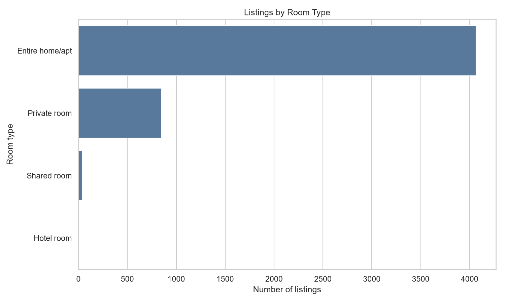

Finding: `Entire home/apt` is the largest room-type category with 4,066 listings.

Business interpretation: The largest room-type category represents the main supply pattern in Stockholm. Hosts, analysts, and marketplace operators should treat this segment as the baseline when comparing pricing, availability, and guest demand.

### Median Listing Price by Room Type

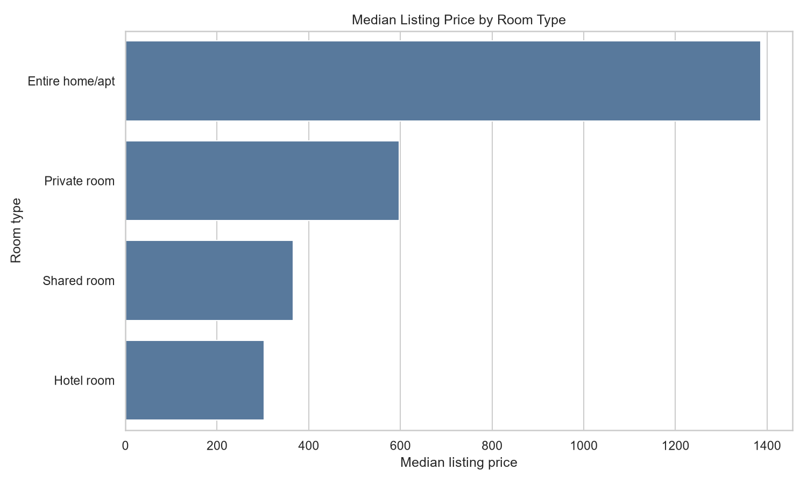

Finding: `Entire home/apt` has the highest median listing price at 1,386.00.

Business interpretation: Room type is a major pricing driver. Price comparisons should be segmented by room type so that private rooms are not compared directly with entire homes or other fundamentally different products.

### Listing Price Distribution

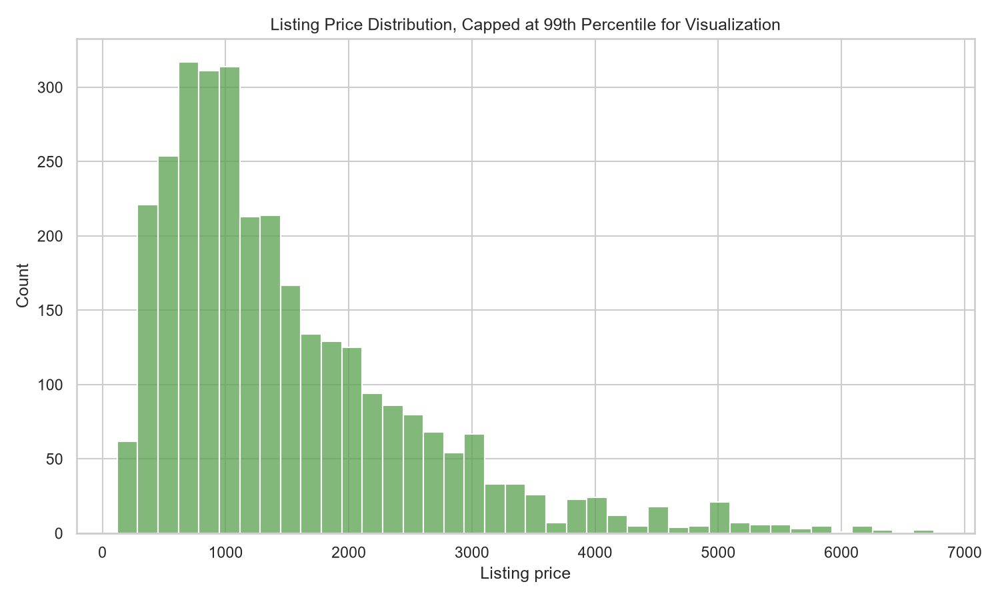

Finding: The chart uses listings prices capped at the 99th percentile (6,753.96) for visualization only. The source data is not modified.

Business interpretation: The distribution helps identify the common price range for typical listings while avoiding a small number of extreme values making the chart unreadable. Any future outlier handling should be documented as an analysis decision, not hidden as data cleaning.

### Median Price by Top 10 Neighbourhoods

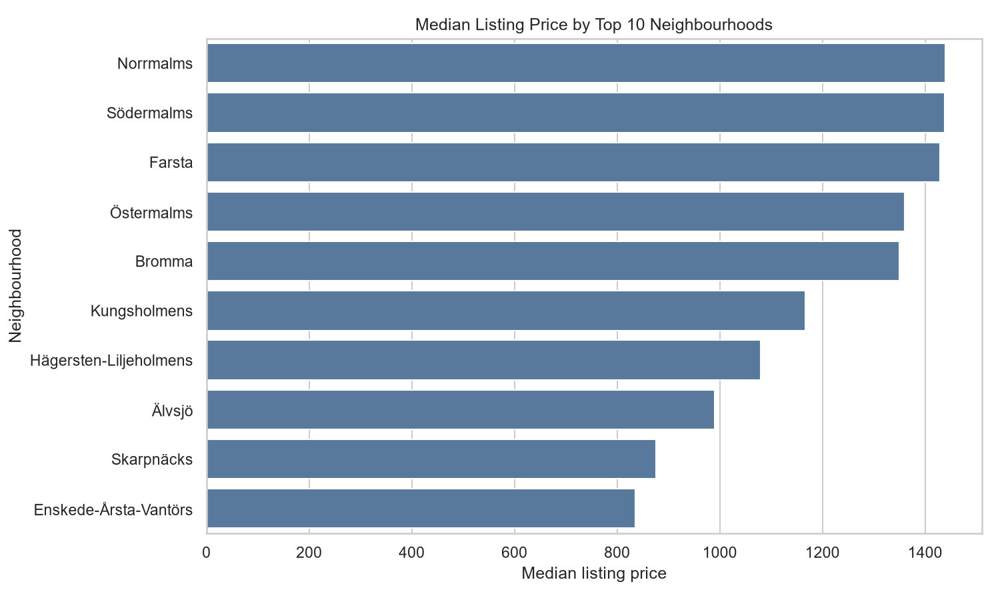

Finding: Among the top 10 neighbourhoods by listing count, `Norrmalms` has the highest median listing price at 1,439.00.

Business interpretation: Neighbourhood affects pricing. This is useful for market positioning, but it should be combined with room type and property type before making pricing recommendations.

### Median Price by Property Type

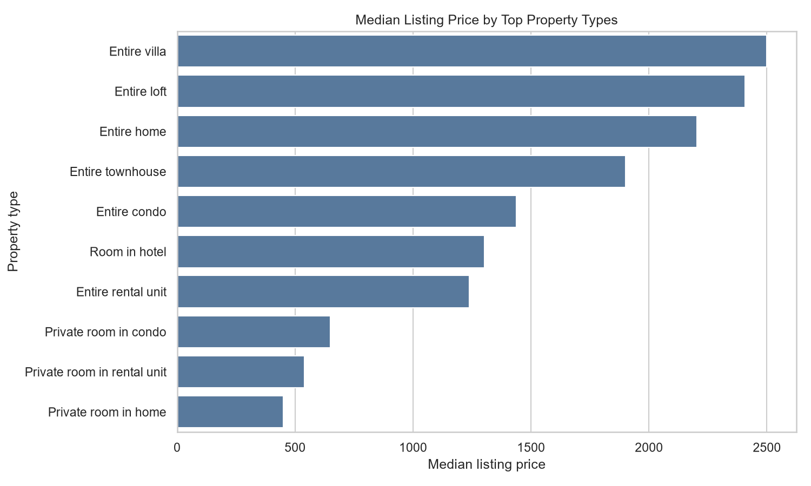

Finding: Among common property types, `Entire villa` has the highest median listing price at 2,500.00.

Business interpretation: Property type adds important context beyond neighbourhood. A compact apartment and a house in the same area may have very different expected prices.

### Available vs Unavailable Calendar Days

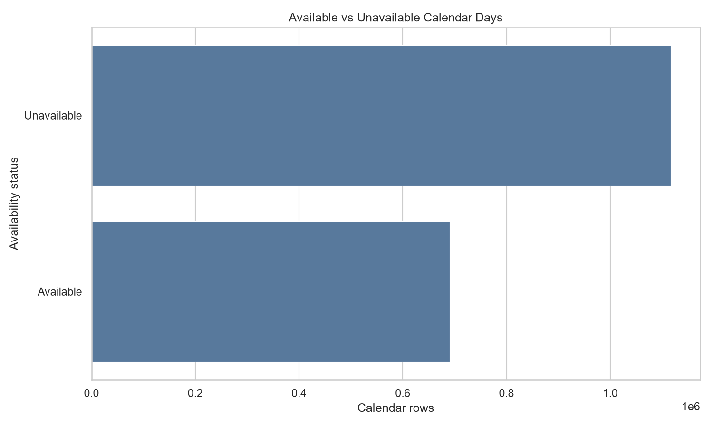

Finding: Calendar availability is 38.21% across all calendar rows.

Business interpretation: Availability gives a rough view of supply still open to guests. It should not be treated as occupancy without stronger assumptions, because unavailable days may mean booked, blocked, or otherwise inactive.

### Monthly Availability Trend

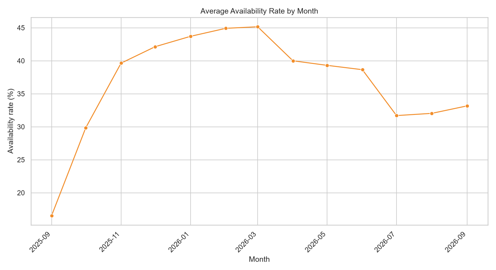

Finding: Monthly availability changes over the calendar period, showing how open supply varies by month.

Business interpretation: Seasonal availability patterns can inform when supply pressure may be higher or lower. Because calendar prices are missing, this trend should not be combined with calendar-based price trends.

### Availability by Room Type

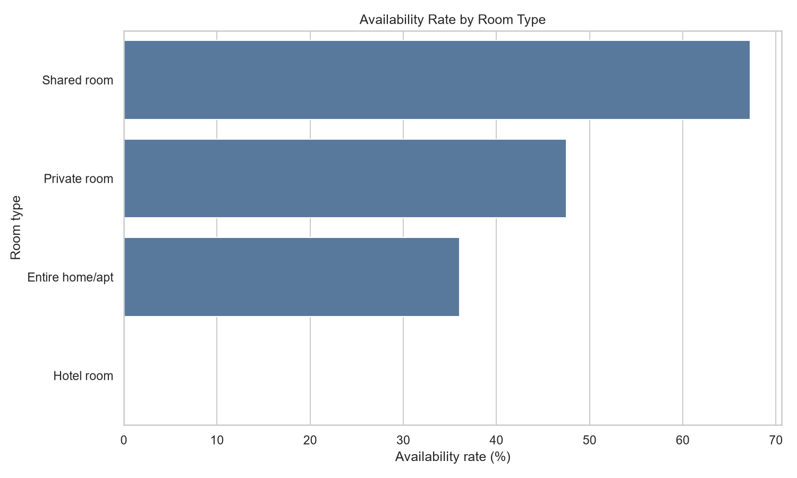

Finding: `Shared room` has the highest availability rate at 67.25%.

Business interpretation: Availability differs by product type. Higher availability may indicate more flexible supply, lower demand, or hosts leaving more dates open.

### Top Hosts by Number of Listings

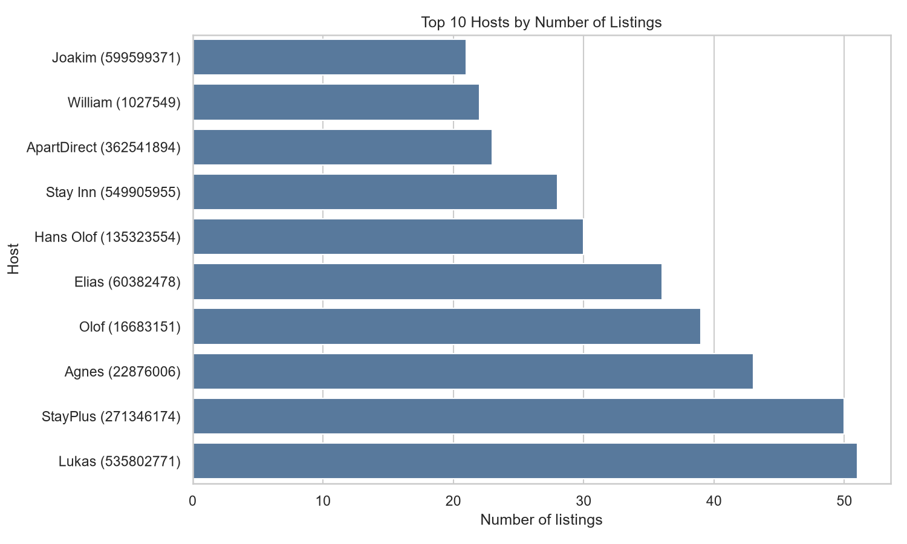

Finding: The top host in this data is `Lukas` with 51 listings.

Business interpretation: A small set of hosts with many listings can influence marketplace supply. Segmenting hosts helps distinguish occasional hosts from more professional operators.

### Median Price by Host Segment

Host portfolio segmentation:

| Host segment | Host count |
|---|---:|
| single-listing hosts | 3,558 |
| small multi-listing hosts | 267 |
| professional hosts | 51 |

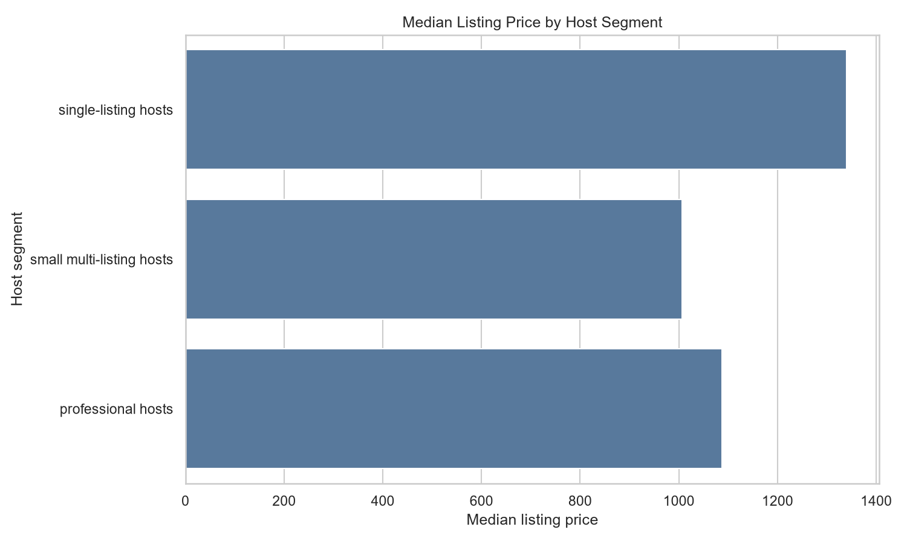

Finding: `single-listing hosts` have the highest median listing price at 1,339.50.

Business interpretation: Host portfolio size may be related to pricing strategy. This does not prove causation, but it is a useful segmentation for Day 3 statistical testing.

### Review Score Distribution

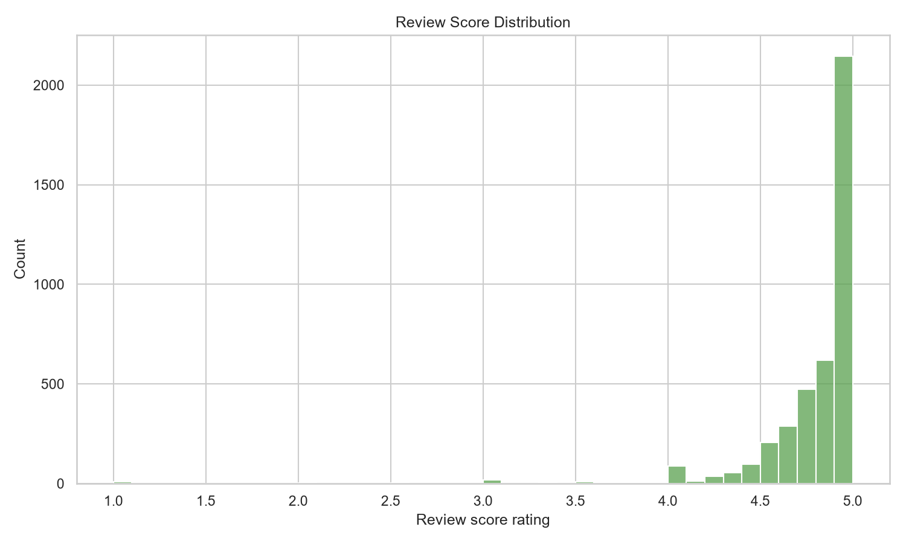

Finding: The average review score is 4.81.

Business interpretation: Review scores are generally useful for quality positioning, but they often cluster near high values. Future analysis should check whether score differences are large enough to be meaningful.

### Price vs Number of Reviews

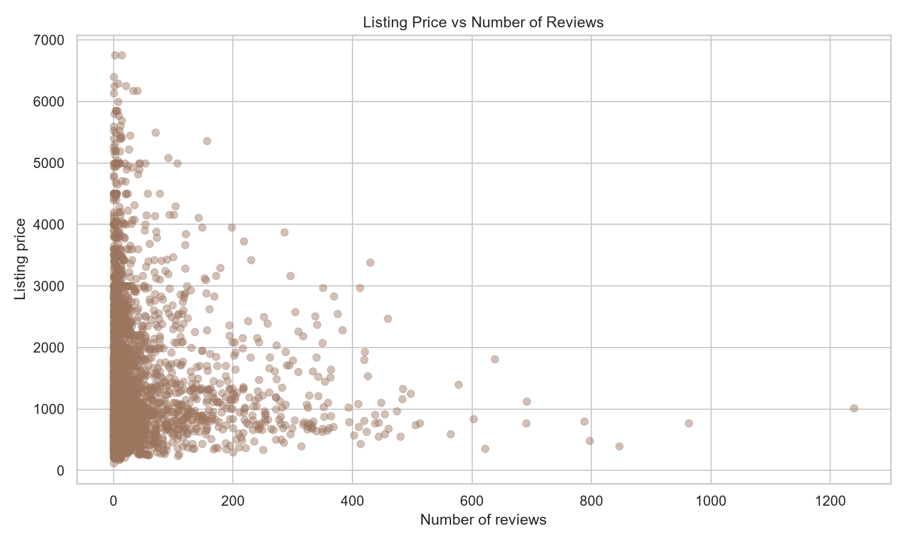

Finding: The scatter plot compares listing price with review volume using listings prices only.

Business interpretation: Review count can act as a rough demand or listing-age signal, but it is not the same as booking volume. Strong claims should wait for statistical testing.

### Top Neighbourhoods by Average Review Score

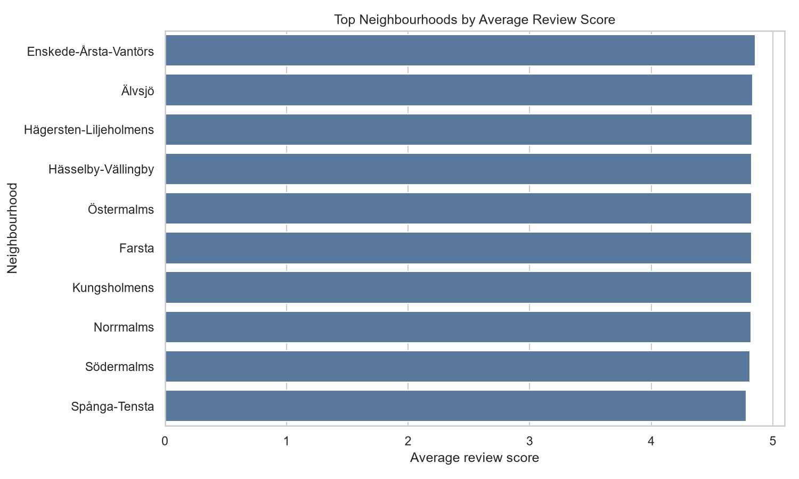

Finding: Among neighbourhoods with at least 20 scored listings, `Enskede-Årsta-Vantörs` has the highest average review score at 4.85.

Business interpretation: This can help identify areas with consistently strong guest satisfaction, but sample-size rules are important so small neighbourhoods do not dominate by chance.

### Review Volume by Month

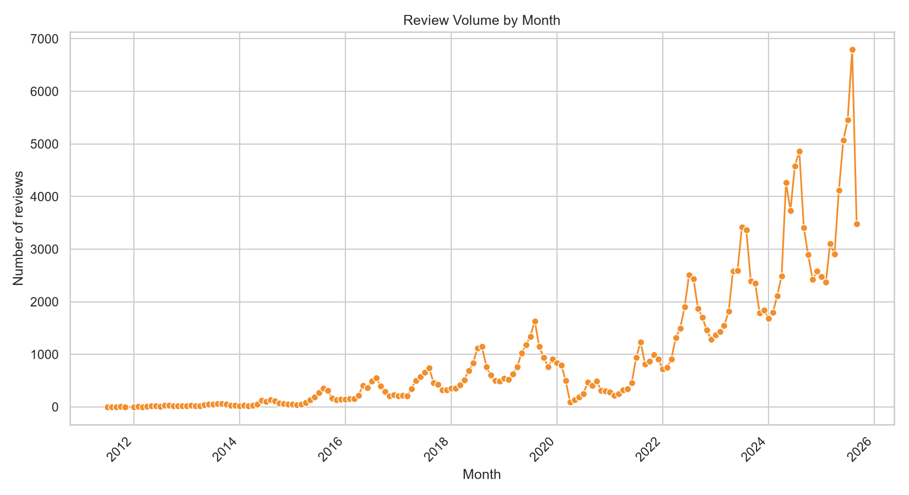

Finding: Review volume varies over time and can be used as a rough signal of historical guest activity.

Business interpretation: Reviews are delayed and incomplete compared with bookings, but they can still reveal demand seasonality and platform activity patterns.

## Limitations

- Calendar `price` and `adjusted_price` are 100% missing, so calendar-based pricing analysis is not possible.
- 35.62% of listings have missing `price` values, so price-based analysis excludes those listings.
- Prices are based on `listings_clean.price` and are reported in the source dataset currency.
- Availability does not equal occupancy because unavailable dates may be booked, blocked, or inactive.
- Review count is not the same as booking count.
- The 99th percentile price cap is used only for visualization, not as a source-data change.
- This is descriptive EDA only; it does not prove causal relationships.

## Recommendations

- Use `listings_clean.price` as the pricing source and clearly exclude missing prices from price-based calculations.
- Segment pricing benchmarks by room type before comparing listings, because entire homes, private rooms, and shared rooms represent different products.
- Use neighbourhood-level median prices as local benchmarks, but compare neighbourhoods together with room type and property type to avoid misleading pricing conclusions.
- Use `calendar_clean` for availability analysis only. Interpret availability carefully because unavailable dates may reflect bookings, host blocks, or inactive inventory.
- Use ML results as directional support only, not automated pricing decisions.
- Keep the calendar price limitation visible in any presentation or interview discussion, especially when explaining why monthly price trends and weekday versus weekend pricing are not included.

## Next Steps for Day 3

- Perform simple statistical tests for price differences by room type and host segment.
- Build a simple ML baseline only after defining a clear target and feature table.
- Add reusable SQL queries for common analysis metrics.
- Validate whether missing listing prices should be excluded or handled explicitly in Day 3 analysis.