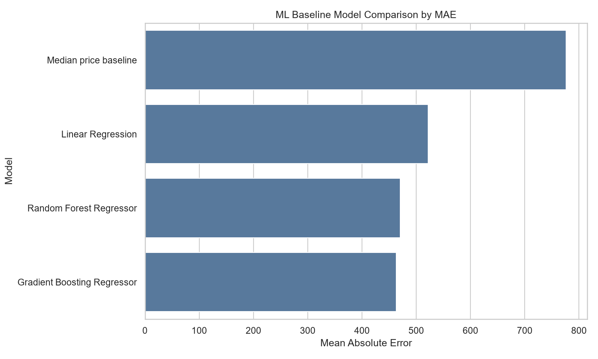
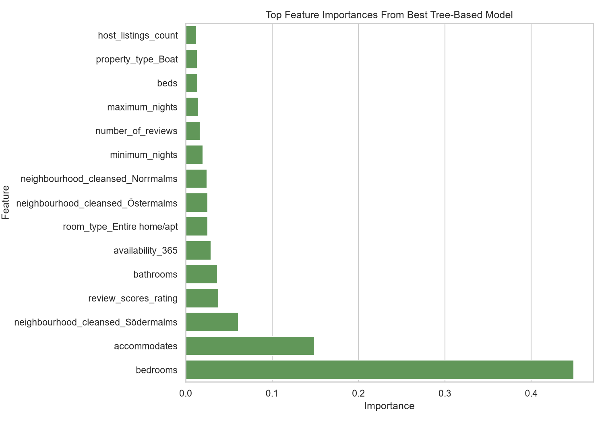

# Day 3 ML Baseline Experiment Report

Selected city: Stockholm, Sweden

Data source: Inside Airbnb

## Problem Framing

This experiment builds a simple baseline model to predict listing price from cleaned listing attributes. It is intended as a learning and assessment baseline, not as a production pricing system.

## Target Variable

- Target: `price` from `listings_clean`.
- Calendar `price` and `adjusted_price` are not used because they are 100% missing in the raw Stockholm calendar data.

## Features Used

`room_type`, `property_type`, `neighbourhood_cleansed`, `accommodates`, `bedrooms`, `bathrooms`, `beds`, `minimum_nights`, `maximum_nights`, `availability_365`, `number_of_reviews`, `review_scores_rating`, `host_is_superhost`, `host_listings_count`, `instant_bookable`

## Preprocessing Steps

- Started with 4,955 listing rows.
- Excluded 1,765 rows with missing price (35.62%).
- Removed 32 rows above the 99th percentile price cap (6,753.96) for modeling only.
- Final modeling row count: 3,158.
- Numeric features use median imputation.
- Categorical features use most-frequent imputation and one-hot encoding.
- Source data is not modified.

## Model Comparison Results

| Model | MAE | RMSE | R2 |
|---|---:|---:|---:|
| Gradient Boosting Regressor | 462.98 | 685.49 | 0.5790 |
| Random Forest Regressor | 470.42 | 697.16 | 0.5646 |
| Linear Regression | 521.79 | 767.62 | 0.4721 |
| Median price baseline | 776.44 | 1,095.37 | -0.0749 |

## Best Model

Best model by MAE: `Gradient Boosting Regressor`.

- MAE: 462.98
- RMSE: 685.49
- R2: 0.5790

Feature importance is shown for the best tree-based model: `Gradient Boosting Regressor`.

Top feature importances:

| Feature | Importance |
|---|---:|
| bedrooms | 0.4491 |
| accommodates | 0.1492 |
| neighbourhood_cleansed_Södermalms | 0.0610 |
| review_scores_rating | 0.0382 |
| bathrooms | 0.0366 |
| availability_365 | 0.0292 |
| room_type_Entire home/apt | 0.0255 |
| neighbourhood_cleansed_Östermalms | 0.0255 |
| neighbourhood_cleansed_Norrmalms | 0.0247 |
| minimum_nights | 0.0198 |
| number_of_reviews | 0.0167 |
| maximum_nights | 0.0148 |
| beds | 0.0138 |
| property_type_Boat | 0.0134 |
| host_listings_count | 0.0127 |

## Business Interpretation

The baseline results show whether simple listing attributes contain useful signal for estimating price. Features such as room type, property type, neighbourhood, capacity, and review-related fields are practical pricing signals, but model outputs should support human judgment rather than replace it.

## Limitations

- This is a simple baseline, not a production model.
- Rows with missing listing prices are excluded.
- Extreme prices above the 99th percentile are removed for modeling only to reduce distortion.
- Calendar prices are not used.
- The model does not include external demand, events, seasonality, competitor prices, or true booking data.
- Feature importance in tree models is directional guidance, not causal explanation.

## Why This Is Not Production-Ready

A production price model would need stronger validation, fresh data, monitoring, bias checks, richer demand signals, and clear business rules. This baseline is useful for demonstrating a reproducible ML workflow and identifying promising features for future work.

## Future Improvements

- Add cross-validation.
- Engineer better location and amenity features.
- Compare performance by room type and neighbourhood.
- Add explainability checks.
- Revisit calendar price analysis only if a future Stockholm calendar dataset includes price values.